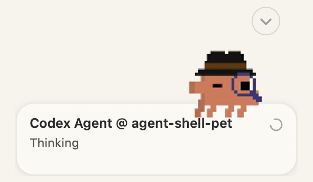

#+TITLE: agent-shell-pet

=agent-shell-pet= adds Codex-compatible animated pets to Emacs
=agent-shell= sessions. The Codex App isn't required.

It listens to the public
=agent-shell= event API, so it works with Codex, Claude, and other ACP-backed
agents.

#+caption: Clawd floating beside an agent-shell activity card.

* Features

- One global pet by default, notifying about all agent-shell buffers.
- Stacked activity cards for different =agent-shell= sessions.
- Visiting a session dismisses only that session's current card.
- Optional one-pet-per-buffer mode.
- Portable Emacs child-frame renderer.
- macOS native renderer that floats above other app windows.
- Uses the same =pet.json= and =spritesheet.webp= format as Codex.app, so you can use any pet from [[https://codex-pets.net/#/pets/clawd][codex-pets.net]].
- Includes the /hatch-pet skill so you can create your custom pets easily.

* Quick Start

#+begin_src emacs-lisp
(add-to-list 'load-path "/path/to/agent-shell-pet")
(require 'agent-shell-pet)

(global-agent-shell-pet-mode 1)
#+end_src

On macOS, build and use the native floating renderer:

#+begin_src bash
make -C renderers/macos
#+end_src

#+begin_src emacs-lisp
(setq agent-shell-pet-renderer 'macos-native)
#+end_src

* Recommended Config

#+begin_src emacs-lisp
(add-to-list 'load-path "/path/to/agent-shell-pet")
(require 'agent-shell-pet)

(setq agent-shell-pet-renderer 'macos-native
      agent-shell-pet-speech-bubble-theme 'light
      agent-shell-pet-size 'medium)

(global-agent-shell-pet-mode 1)
#+end_src

* Common Options

Choose a pet:

#+begin_src emacs-lisp
(setq agent-shell-pet-id "clawd")
#+end_src

Use one pet per =agent-shell= buffer instead of one global pet:

#+begin_src emacs-lisp
(setq agent-shell-pet-scope 'buffer)
#+end_src

Adjust size:

#+begin_src emacs-lisp
(setq agent-shell-pet-size 'small)  ; 'large, 'medium, or 'small
#+end_src

Use the dark activity card:

#+begin_src emacs-lisp
(setq agent-shell-pet-speech-bubble-theme 'dark)
#+end_src

* Installing More Pets

=agent-shell-pet= discovers pets from:

- =agent-shell-pet-user-pets-directory=
- =${CODEX_HOME:-$HOME/.codex}/pets/=
- the package's bundled =pets/= directory

Install from [[https://codex-pets.net/][codex-pets.net]] into the Emacs pet directory:

#+begin_src emacs-lisp
(agent-shell-pet-install-from-codex-pets "https://codex-pets.net/#/pets/canarinho")
#+end_src

Install into the Codex pet directory instead:

#+begin_src emacs-lisp
(agent-shell-pet-install-from-codex-pets "canarinho" 'codex)
#+end_src

Pets installed with the Codex CLI are picked up too:

#+begin_src bash
npx codex-pets add canarinho
#+end_src

* Pet Format

#+begin_example
<pet-id>/
├── pet.json
└── spritesheet.webp
#+end_example

Atlas requirements:

- =1536x1872=
- =8= columns by =9= rows
- =192x208= cells
- transparent PNG or WebP source, packaged as =spritesheet.webp=

For creating new pets, see [[file:docs/hatch-pet.org][docs/hatch-pet.org]].

* Commands

- =M-x global-agent-shell-pet-mode=
- =M-x agent-shell-pet-show=
- =M-x agent-shell-pet-hide=
- =M-x agent-shell-pet-wave=
- =M-x agent-shell-pet-macos-build-helper=

* Development

Run tests:

#+begin_src bash
emacs --batch -L . -l tests/agent-shell-pet-tests.el -f ert-run-tests-batch-and-exit
#+end_src

Byte-compile:

#+begin_src bash
emacs --batch -L . -f batch-byte-compile agent-shell-pet.el
#+end_src

